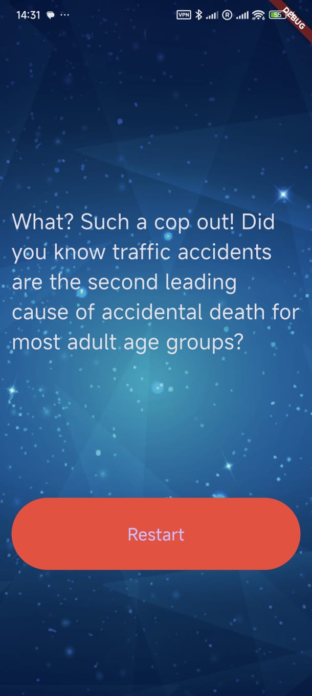

# Destini Flutter App

A choose-your-own-adventure storytelling app built with Flutter. The app lets users make choices that drive the direction of the story, leading to different outcomes.

## 📱 App Features

- Interactive story progression based on user choices
- Rich UI with background image and dark theme
- Logical state management using `StatefulWidget`
- Modular code using `Story`, `StoryBrain`, and main `StoryPage`

## 🛠 Project Structure

```
lib/
├── main.dart           # App entry point, UI logic
├── story.dart          # Story model with title and choices
└── story_brain.dart    # Core logic to control story flow
images/
    └── background.png  # Background image for the app
```

## 🚀 Getting Started

1. **Clone the repo:**

   ```bash
   git clone https://github.com/aarogyaojha/destini_flutter.git
   cd destini_flutter
   ```

2. **Install dependencies:**

   ```bash
   flutter pub get
   ```

3. **Add assets:**
   Ensure the `background.png` image is located in `images/`, and your `pubspec.yaml` includes:

   ```yaml
   flutter:
     assets:
       - images/
   ```

4. **Run the app:**
   ```bash
   flutter run
   ```

## 🤔 How It Works

- The app displays a story and two options.
- Based on user input, `StoryBrain` updates the `_storyNumber` to show a new scenario.
- If an ending is reached, only one "Restart" option is displayed.

## 🧠 Logic Flow

Story branching is managed inside the `nextStory()` function in `story_brain.dart` with predefined paths for each choice.

## 📷 Preview

<p float="left">
  
  
</p>

## 📄 License

This project is licensed under the [MIT License](LICENSE).

---

Made with ❤️ in Flutter
